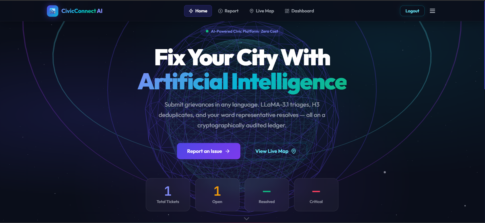
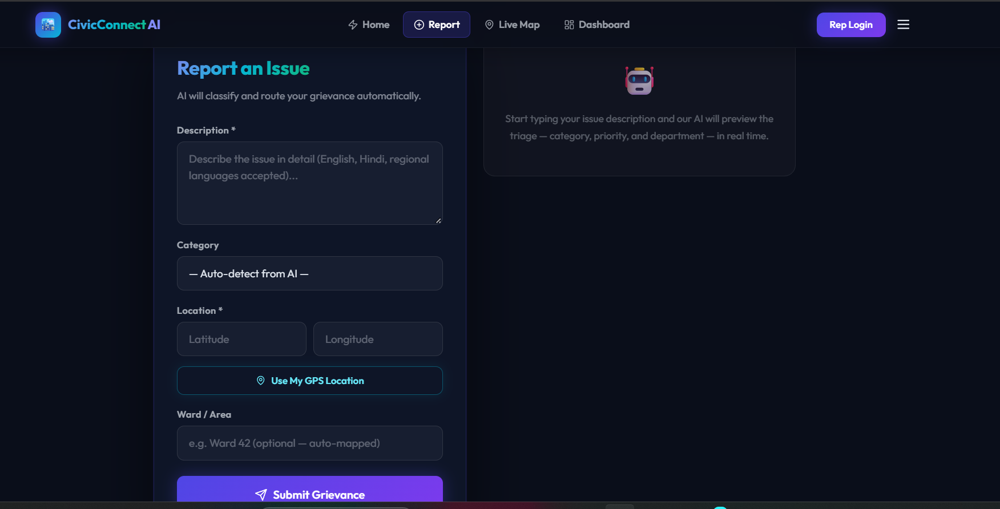
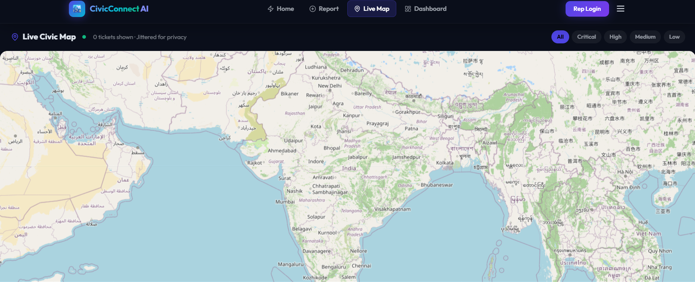
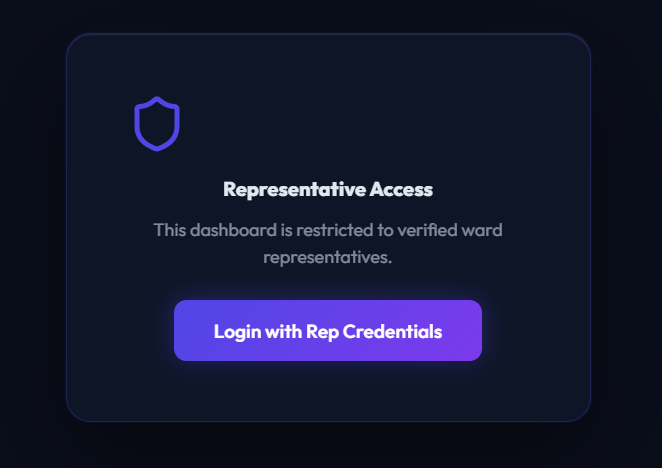

# CivicConnect AI 🌍

> **Zero-Cost AI Civic Grievance Triage & Verified Resolution Platform**

CivicConnect AI is a premium, open-source civic grievance management platform built to help citizens report city issues (potholes, water leaks, power outages) and get them resolved efficiently. 

It features an **AI-powered triage pipeline**, a **tamper-proof cryptographic audit ledger**, and a stunning **3D glassmorphic user interface**. 


---

## 🌟 Key Features

- **🤖 Zero-Cost AI Triage:** Multilingual citizen reports are automatically translated and classified (Category, Priority, Department) using **Groq's LLaMA-3.1-8b** free tier.
- **🗺️ Intelligent Deduplication:** Automatically groups similar reports using **Uber H3 Spatial Indexing** and **MiniLM Semantic Embeddings** (Cosine Similarity).
- **🔒 Tamper-Proof Audit Trail:** Every ticket state change is permanently recorded in an immutable **SHA-256 Hash Chain ledger**.
- **🎨 Premium 3D UI:** Built with `@react-three/fiber` and Framer Motion, featuring an interactive rotating wireframe globe, 3D tilt cards, and neon aesthetics.
- **✅ Proof-of-Fix Quorum:** Issues are only closed when verified by 3 independent citizen votes.
- **📍 Privacy-First Mapping:** Leaflet map visualizes tickets but dynamically applies a ±150m geographic jitter to protect reporter privacy.

---

## 🏗️ Architecture

The system is separated into three decoupled microservices:

1. **Frontend (Port 5173):** React 18 + Vite PWA with Three.js graphics and Socket.IO real-time updates.
2. **Gateway (Port 5000):** Node.js Express REST API connected to MongoDB, managing the Hash Chain and WebSockets.
3. **AI Engine (Port 8000):** Python FastAPI microservice handling LLaMA-3.1 inference and MiniLM embedding generation.

*For detailed architectural flow, schema breakdowns, and API references, please see [`WORKS_DONE.md`](./WORKS_DONE.md).*

---

## 🚀 How to Run Locally

### Prerequisites
- Node.js (v18+)
- Python (3.10+)
- MongoDB Atlas Account (or local MongoDB)
- [Groq Cloud](https://console.groq.com) API Key (Free)

### 1. Setup Environment
Clone the repository and set up your `.env` file:
```bash
git clone https://github.com/SwarnaTripathi/CivicConnect.git
cd CivicConnect
cp .env.example .env
# Edit .env with your MONGO_URI and GROQ_API_KEY
```

### 2. Start the Backend Gateway
```bash
cd backend
npm install
npm start
# Server runs on http://localhost:5000
```

### 3. Start the AI Microservice
```bash
cd ai-service
pip install -r requirements.txt
uvicorn main:app --reload --port 8000
# Server runs on http://localhost:8000
```

### 4. Start the 3D Frontend
```bash
cd frontend
npm install
npm run dev
# App runs on http://localhost:5173
```

---

## 🖼️ Screenshots

<div align="center">
  
  <br><i>Landing Page</i><br><br>

  
  <br><i>Report an Issue Form</i><br><br>

  
  <br><i>Live Civic Map</i><br><br>

  
  <br><i>Representative Login</i><br><br>
</div>

---

## 📸 Demo Credentials

To access the Representative Dashboard (`/login`):
- **Username:** `admin`
- **Password:** `admin123`

---

## 🛠️ Technology Stack

- **Frontend:** React 18, Vite, Three.js (`@react-three/fiber`), Tailwind CSS, Framer Motion, React Router v6.
- **Backend:** Node.js, Express, Socket.IO, Mongoose, JWT.
- **AI/ML:** Python, FastAPI, Groq (LLaMA-3.1), `sentence-transformers` (MiniLM-L12-v2), `h3` (Uber spatial index).
- **Database:** MongoDB.
- **Security:** SHA-256 Crypto Hashing, JWT Bearer tokens.

---

### Developed By
**Swarna Tripathi** & Antigravity AI
